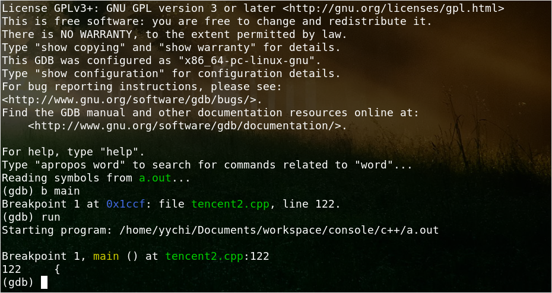

废话以后有时间再加。

首先编译时开启调试选项：
```bash
g++ main.cpp -g -O0
```
`-O0`指定编译器的优化级别为0，即不优化。

然后编译出来的可执行文件，默认名字是`a.out`. 直接了当，用gdb打开之，
```bash
gdb a.out
```

<!-- more -->

要调试必然要打断点，两种方式：指定行数；指定函数。
```bash
(gdb) break 10  // create breakpoint at line 10
(gdb) break main  // create breakpoint at the entrance of main
```
使用`list`在gdb中查看代码块以确定你要在哪一行设置断点（这就很麻烦，所以一般直接在main函数打个断点，然后单步去run）。

设好断点以后，使用`run`启动程序，程序会在断点处停顿，等待你的输入指令。


使用`next`进行单步执行，使用`step`步入。所谓步入就是如果有函数调用，程序会跟踪到所调用的函数内部的代码，而单步的话，则会直接完成函数调用，获得返回值（如果有的话）。

使用`info locals`查看栈变量的值，使用`info args`查看函数传入参数的值。使用`print <variable>`查看指定变量的值。

## 备注

- GDB里面的命令都有缩写（break=b, next=n, step=s, ...）
- 什么命令也不敲直接回车默认执行上一条命令
- 使用`help <command>`来获取相关命令的使用帮助
